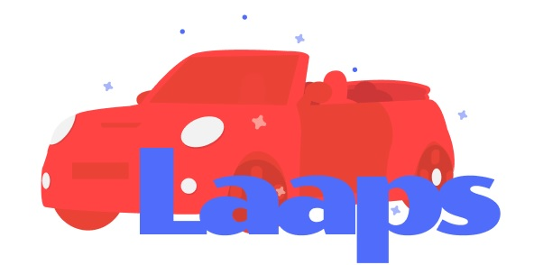
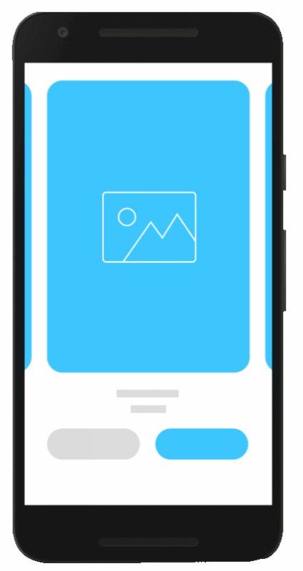
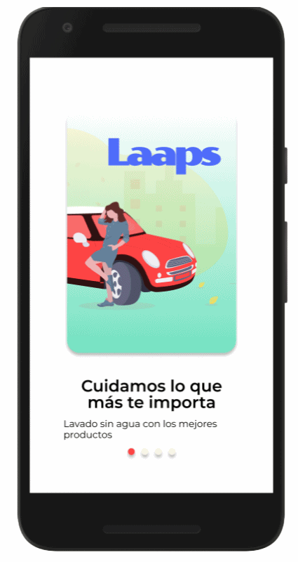
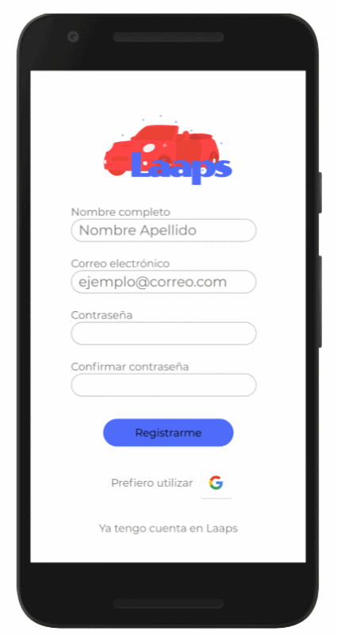
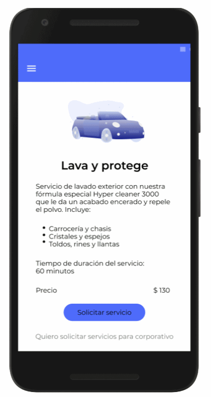
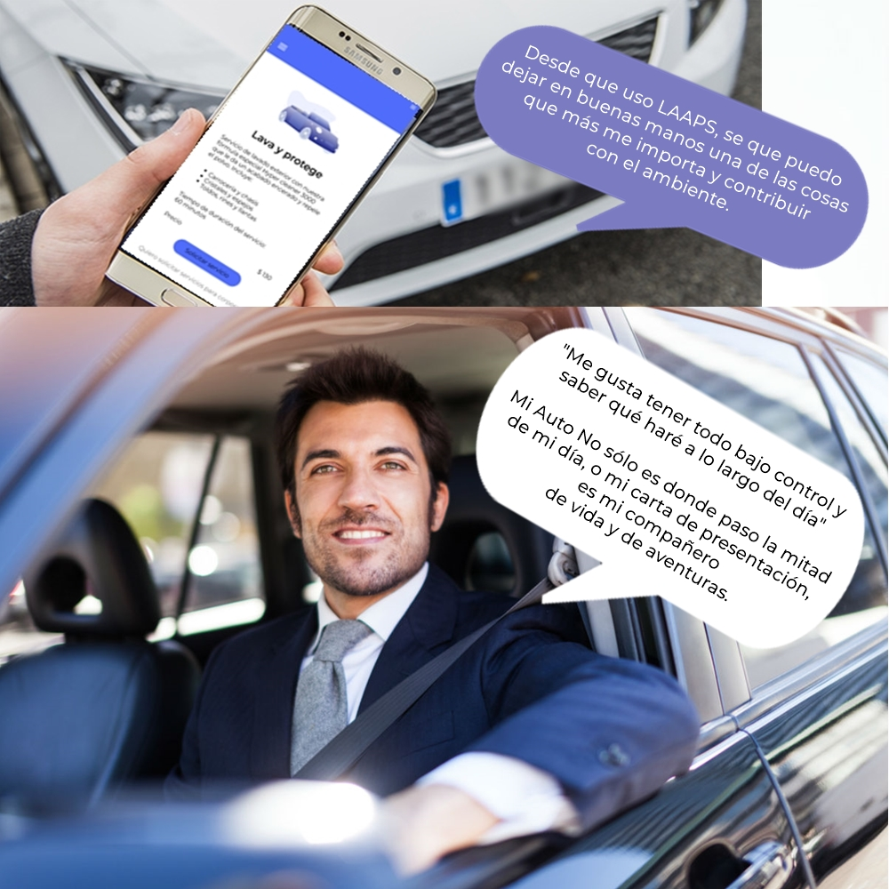

El nombre de la aplicación es:
    **Laaps**  
___    *Cuidamos lo que más te importa* ___

 

> Este reto nos lo trae una startup: Laaps un emprendimiento dedicado al lavado de autos a domicilio sin utilizar agua.

>En Laaps buscan transformar su negocio en un negocio escalable y con más visibilidad. 
El requerimiento es diseñar y desarrollar una webapp (tipo Uber) a través de la cual los usuarios puedan fácilmente acceder y pedir el servicio de lavado de auto determinando la ubicación a través de algún servicio de geolocalización, y al mismo tiempo puedan saber quién lavará su auto, cuánto tiempo tomará...

 __SI  QUIERES VER CÓMO FUNCIONA LA APP ENTRA A ESTE LINK:__ 
Debes tener en cuenta que la app por los momentos está diseñada en mobile first **Galaxy S5**, por lo que cuando entres al link da click al boton derecho, seleccionas inspeccionar y en en el select que dice RESPONSIVE selecciona **Galaxy S5**.
 

https://laaps-11b08.web.app/

 
 
 
 
  |  **Herramientas y tecnologías usadas en la app**     | 
| :-------------: |
|Figma |
| CSS |
|Materialize|
|Mapbox-Geolocalización|
| Javascript|
|React JS|
|Firebase|
|Git & Github|
 
**¿Qué es laaps?**
Emprendimiento dedicado al lavado de autos a domicilio
Sin agua
Preocupados por el medio ambiente
 
 **Desarrollo y planificación de la app**
 
**1-** Con la aplicación para proyectos de diseño *FIGMA*, iniciamos realizando la versión esquemática de lo que fue nuestra idea, planeando así previamente la estructura y los elementos de la página web.

  
**2-** Fue el diseño final de lo que sería *Laaps* donde definimos paleta de colores, tipografía y en general el flujo de navegación de la aplicación. De esta manera poder tener una visión más detallada, precisa y global de los contenidos necesarios plasmando así el resultado final de una versión simulada en alta fidelidad.
 

  

  

  

**Test de usabilidad con usuarios**

 Al inicio del diseño de la aplicacion construimos una idea de acuerdo a las encuestras realizadas y creyendo que habíamos tomando buenas decisiones sin embargo al recibir los comentarios de parte de los usuarios a quien le solicitamos el testeo de usabilidad de la app, tomando en cuenta sus recomendaciones decidimos aplicar mejoras, volviendo a solicitar feedback y dejando al usuario satisfecho con lo que implementamos en la app.

 **¿Cómo funciona la app**
 
 _Tendrá tres secciones:_
 
 >La primera es para el área del usuario,podrá acceder de manera fácil registrándo su cuenta, una vez logueado podrá ver los servicios que ofrecemos, está lo opión de que realice pagos por medio de tarjeta de crédito teniendo opción de guardar o no los datos,haciendo que se sienta seguro con nosotros, puede ver los datos de la persona que va a lavar su coche y hacer un seguimiento preciso desde que solicita el servicio, viendo la ruta por medio de geolocalización siguiendo el inicio del camino hasta que le notificamos que el trabajo ya fue realizado.
 
 >La segunda es para el socio/trabajador, en donde también podrá loguearse con su nombre de usuario y contraseña, podrá ver distintas opciones de ruta para dar el servivio, y una vez que seleccione alguna, verá los datos de la persona, los datos del coche que va a lavar,notificar cada etapa del servicio,visualizar sus ganancias y calificaciones.
 
 >La tercera es para la parte administrativa y de ventas, allí podrán:
 -Información del servicio por medio de una App.
 -Tener visibilidad de solicitudes y empleados.
 -Generar reportes de acuerdo a las necesidades.
 -Visibilidad de ganancias.
 
 

  
